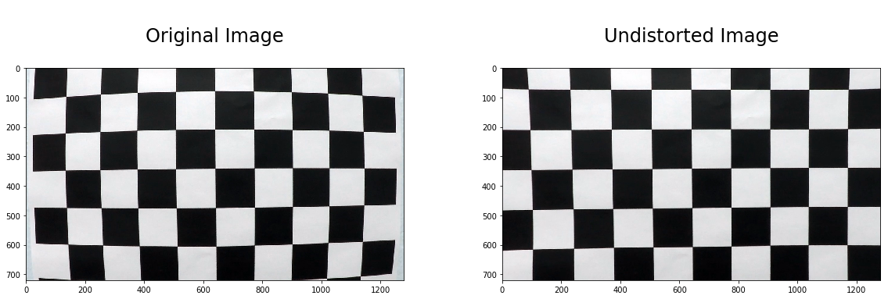
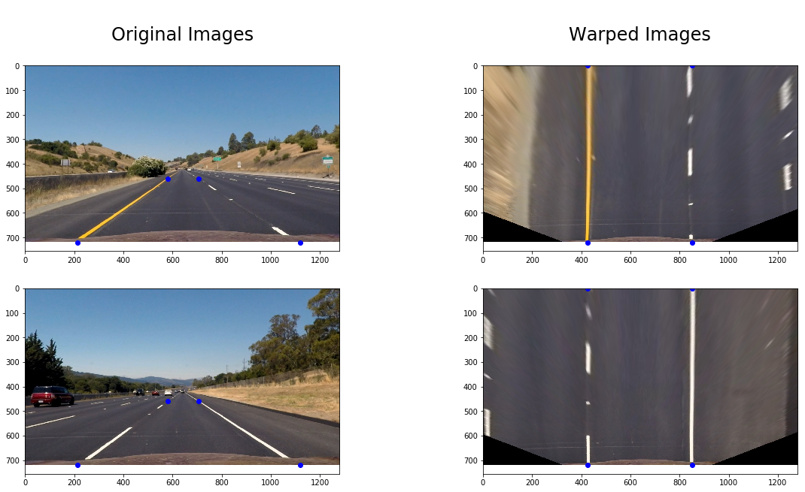
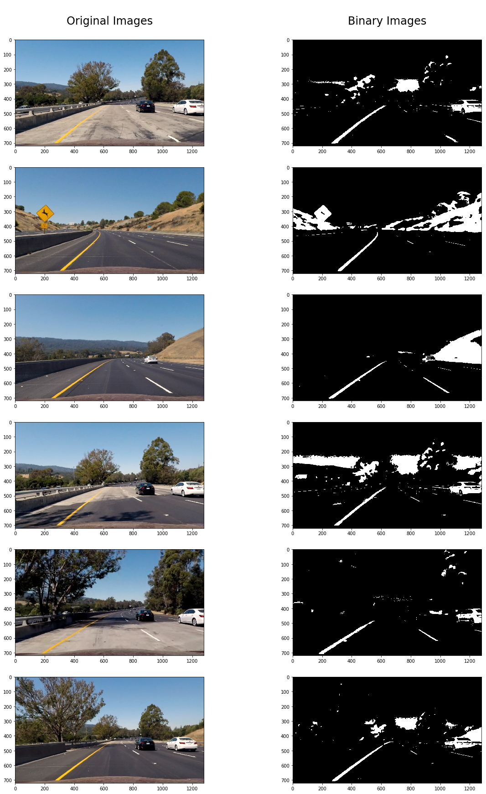
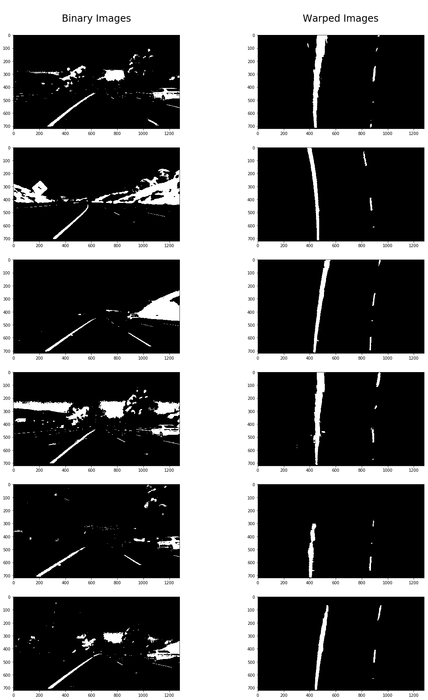
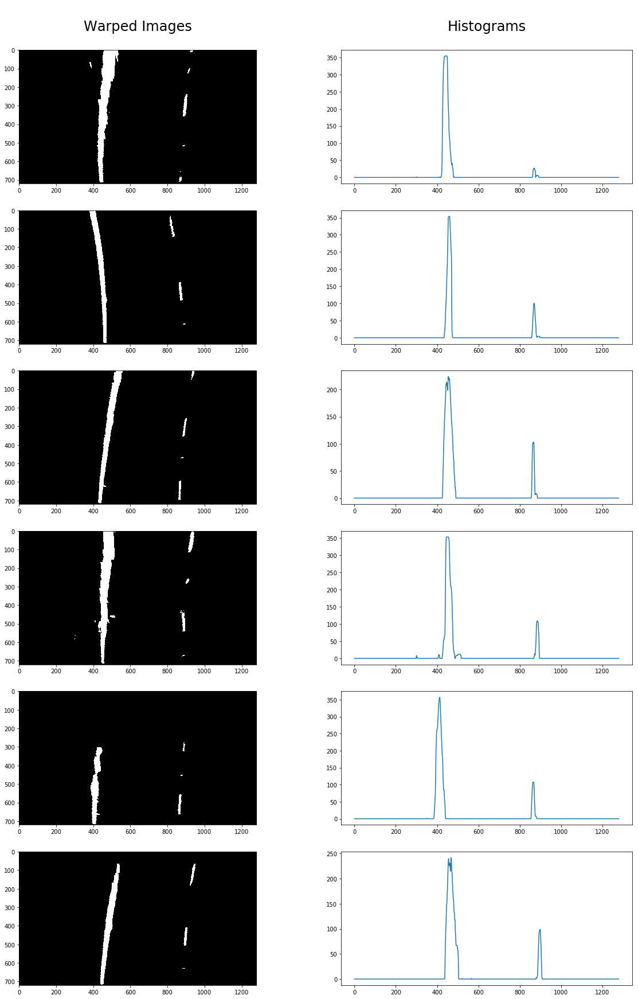
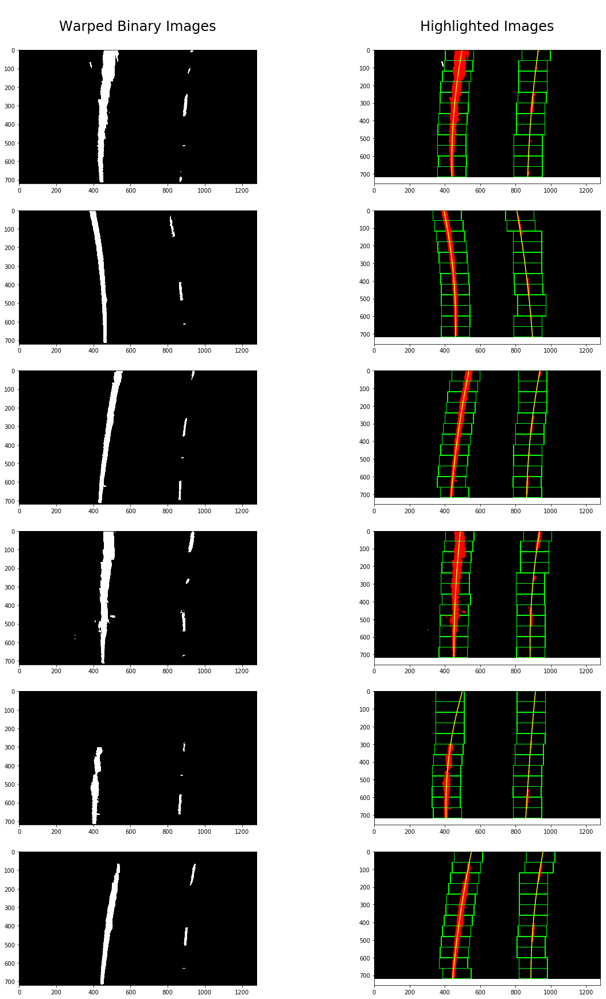
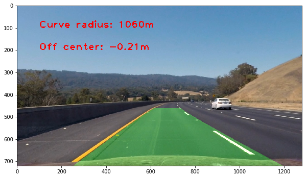

## Writeup Template

### You can use this file as a template for your writeup if you want to submit it as a markdown file, but feel free to use some other method and submit a pdf if you prefer.

---

**Advanced Lane Finding Project**

The goals / steps of this project are the following:

* Camera Calibration
* Perspective transform
* Use color transforms, gradients, etc., to create a thresholded binary image.
* Apply a perspective transform to rectify binary image ("birds-eye view").
* Detect lane pixels and fit to find the lane boundary.
* Determine the curvature of the lane and vehicle position with respect to center.
* Warp the detected lane boundaries back onto the original image.
* Output visual display of the lane boundaries and numerical estimation of lane curvature and vehicle position.

[//]: # (Image References)

[calibration]: ./output_images/calibration.png "Calibration | Undistorted"
[warped]: ./output_images/warped.png "Warped"
[binary]: ./output_images/binary.png "Binary"
[binary_warped]: ./output_images/binary_warped.png "Binary warped"
[histograms]: ./output_images/histograms.png "Histograms"
[highlighted]: ./output_images/highlighted.png "Highlighted"
[result]: ./output_images/result.png "Result"


### Camera Calibration
First step is camera calibration. Process is pretty straightforward and looks like this:
1. read multiple calibration images
2. finds all chessboard corners using cv2 API method findChessboardCorners
3. get distortion coefficients using cv2 API method calibrateCamera
See my implementation in [utils/img.py lines 28-39](utils/img.py#L28-L39) and calls of methods in [CarND-Advanced-Lane-Lines.ipynb](CarND-Advanced-Lane-Lines.ipynb).

Distortion coefficients found on previous steps are using for images undistorting.



### Perspective transform
Second step is perspective transform, which allows us to see images as they seen from above. To achieve that we should do several things:
1. define 4 source points at original image (in our case points will lay on line lanes)
2. define 4 destination points in form of rectangle
3. find warping and unwarping matrixes using cv2 API call getPerspectiveTransform [utils/img.py lines 42-47](utils/img.py#L42-L47)
3. do actuall image transform using these matrixes [utils/img.py lines 54-55](utils/img.py#L54-L55)

| Source        | Destination   | 
|:-------------:|:-------------:| 
| 215, 720      | 426, 720      | 
| 580, 460      | 426, 0        |
| 705, 460      | 852, 0        |
| 1120, 720     | 852, 720      |




### Identifying white and yellow lanes
Third step is identifying the white and yellow lanes. To achieve this we should apply several techniques described below.
1. image converts to YUV color space
2. y-channel is thresholded for all values above 200. This allows us to identify white lines
3. difference between u-channel and v-channel is thresholded for all values above 30. This allows us to identify yellow lines
Implementation could be found in [utils/img.py lines 62-81](utils/img.py#L62-L81).




### Warping and masking binary images
Now, when we have pre-processed images with clear identification of white and yellow lanes, it is time to warp them using warping matrix found on previous step. Applying region mask to points near the lateral edges allows us to reduce noise ([utils/img.py lines 84-88](utils/img.py#L84-L88)).
Binary and warped/masked images are shown below.



### Locating Lane Lines
Finally we have all data we need to start locating lane lines.
Algorithm looks like this:
1. Find a good starting point by computing a histogram of the lower half of the binary input image.
Identify the two peaks of it and treat them as starting x values.

2. Calculate window dimensions and apply moving windows algorithm:
   - Rectangular windows are placed at the bottom of the image and centered at each histogram peak.
   - Points that fall within either window are identified as belonging to that lane.
   - When there are enough points identified, then the center for the next window is set at the mean of those points.
   - Windows are then stacked on top of the previous windows, and this process is repeated.
3. Once the points in the lane lines are identified, second-order polynomials are fit to those points using np.polyfit. 

My implementation could be found in [utils/img.py lines 99-158](utils/img.py#L99-L158).




### Calculating Position and Radius of Curvature
1. Transform pixels to meters.
2. Use [this approach](http://www.intmath.com/applications-differentiation/8-radius-curvature.php) to calculate actual values (see [utils/img.py lines 180-185](utils/img.py#L180-L185)).


### Result



### Pipeline
Final pipeline looks like this (also could be found in [CarND-Advanced-Lane-Lines.ipynb](CarND-Advanced-Lane-Lines.ipynb)):
```
def pipeline(img):
    # Convert RGB -> BGR
    img = img[:,:,::-1]
    
    # Undistort image
    undist_image = undistort(img, mtx, dist)
    
    # Process image
    processed_image = process(undist_image)
    
    # Warp image
    warped_image = warp(processed_image, M)
    
    # Mask the warped image
    masked_image = region_mask(warped_image)
    
    # Find the polynomial coefficients
    warped, L_L_CF_PX, R_L_CF_PX, L_L_CF_M, R_L_CF_M = find_lane_lines(masked_image, xm_per_px, ym_per_px, draw = False)
    
    # Fill lane
    filled_lane = fill_lane(undist_image[:,:,::-1], Minv, L_L_CF_PX, R_L_CF_PX)
    
    # Add stats
    return stats(filled_lane, L_L_CF_M, R_L_CF_M, L_L_CF_PX, R_L_CF_PX, xm_per_px, ym_per_px)
```

### Result (video, youtube)
[](https://www.youtube.com/watch?v=nK3e_XwMZ8c)

You can also find it [here](./project_video.mp4).

---

### Discussion
Must admit that my implementation is not ideal and doesn't work great on advanced videos. 
In future I'm planning to make improvements in several areas: 
1. better image pre-processing to cover various cases like shadows, partial overlapping with different objects and even different lane colors. 
2. define rules for reducing difference in polynomial coefficients
3. try to apply machine learning approach for detecting lanes
